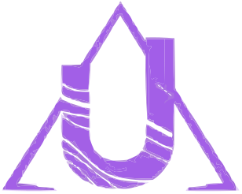

#  Hello World, I'm Alan Nin

  
  
  
Building immersive, interactive web experiences from the Dominican Republic 🇩🇴

  
  
  
  

## 🚀 Featured Projects

  <table>
  <tr>
    <td width="50%" valign="top">
      <h3 align="center">WithYou</h3>
      

        
      

      

        Online platform that connects individuals with accessible psychological services
      

      

        
        
        
        
      

    </td>
    <td width="50%" valign="top">
      <h3 align="center">Medelle</h3>
      

        
      

      

        Desktop patient management solution for medical professionals
      

      

        
        
        
        
      

    </td>
  </tr>
  <tr>
    <td width="50%" valign="top">
      <h3 align="center">iNoted</h3>
      

        
      

      

        Quick & intuitive note-taking mobile app with local storage for complete privacy
      

      

        
        
        
        
      

    </td>
    <td width="50%" valign="top">
      <h3 align="center">UltimaTio</h3>
      

        
      

      

        Web-based multimedia streaming platform with personalized recommendations
      

      

        
        
        
        
      

    </td>
  </tr>
</table>

  <h3>Spammy – AI-Powered Email Spam Detection</h3>
  

    
  

  
Web app leveraging a custom ML model to classify email content as spam or legitimate

  

    
    
    
    
  

## 💻 Tech Stack

  
  
  
  ### Languages
  
  
  
  
  
  
  
  
  ### Front-End
  
  
  
  
  
  
  

  ### Back-End
  
  
  
  
  
  
  
  ### Database & APIs
  
  
  
  
  
  
  
  ### DevOps & Tools
  
  
  
  
  
  

## 📊 GitHub Stats

  
  

---

<i>Crafting the web, one pixel at a time.</i>

